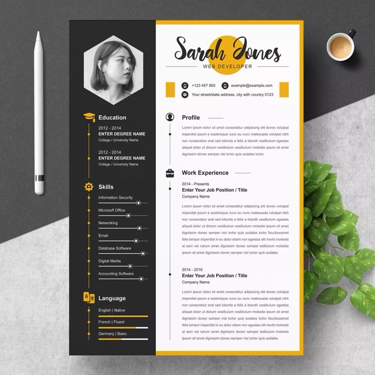

# cv_template

Ein Lebenslauf, in Flutter erstellt.

Man kann die verschiedenen Punkte eines Lebenslaufes in einer Datei hinzfügen und diese werden dann entsprechend angezeigt.

## Verwendung

Die Punkte des Lebenslaufes müssen in [die Config](lib/config/config.dart) eingetragen werden.

Das Avatar-Bild muss in den üblichen Ordner für Assets in Flutter gelegt werden ([assets/images/](assets/images/)) und `profile_picture.jpeg` heißen.

## Vorlage

Die Vorlage des Flutter-Lebenslaufes ist die Folgende: 

Sie ist auch unter [diesem Link][1] zu finden.

[1]: https://masterbundles.com/wp-content/uploads/2022/04/01_clean-professional-creative-and-modern-resume-cv-curriculum-vitae-design-template-ms-word-apple-pages-psd-free-download-12.jpg